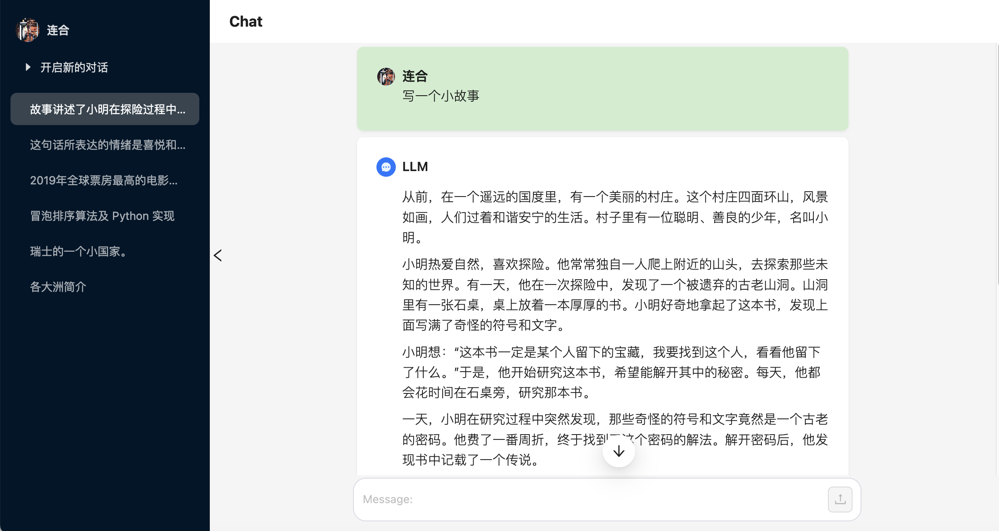

# A Simple LLM DEMO Service for Deployment



## Installation

```bash
./install.sh
```

## Start DEMO

### Quick Startup
```bash
./run.sh
```

### Development Mode

#### Backend: LLM & embedding Layer
```bash
./run.sh model stop (Optional)
./run.sh model dev
```

#### Backend: View Layer
```bash
./run.sh view stop (Optional)
./run.sh view dev
```

#### Frontend
```bash
./run.sh frontend dev
```

## Configuration

### OAuth

**[Mandatory]** Create OAuth Application of [Github](https://docs.github.com/apps/oauth-apps/building-oauth-apps/authorizing-oauth-apps) & [Google](https://developers.google.com/identity/sign-in/web/sign-in) first and fill the section `frontend-env` in `configs/global.yml` as follow:

```yaml
frontend:
  env:
    NEXTAUTH_URL: 'http://localhost:8501'
    NEXTAUTH_SECRET: 'A CHOSEN SECRET TOKEN'

    GITHUB_ID: "$GITHUB_ID"
    GITHUB_SECRET: "$GITHUB_SECRET"

    GOOGLE_ID: "$GOOGLE_ID"
    GOOGLE_SECRET: "GOOGLE_SECRET"
```

### LLM service

First configure the LLM model for local deployment by the section `llm` in `configs/global.yml` as follow:

```yaml
llm:
  # The model_name defined by yourself for llm.chat(query, select_model=model_name)
  # Multiple subsection in `llm` section means deploying multiple models
  model_1: 
    # The llm type support in backend/llm, including ['ChatGLM', 'Qwen']
    type: ChatGLM
    # local llm model path or huggingface remote repo name
    llm_name_or_path: THUDM/chatglm3-6b 
    ...
```

Configure the section `api-model` in `configs/global.yml` as follow:

```yaml
api:
  model:
    host: '0.0.0.0'
    port: 10080
```

### MongoDB
- Revise `/etc/mongodb.conf`, and startup mongodb service by `systemctl`|`service`
- **[Mandatory]** Configure the `mongo` section in `configs/global.yml` as follow:

```yaml
mongo:
  database: chat
  host: 0.0.0.0
  port: 27017
```

## Maintance

### Restart Service

**Backend: LLM & embedding Layer**
```bash
./run.sh model restart
```

**Backend: View Layer**
```bash
./run.sh view restart
```

### Processing Feedback

**Export**
```bash
python -m scripts.history_data_process --operation export --output_dir $EXPORT_DIR --output_name $EXPORT_NAME --split_size $SPLIT_SIZE
```

- EXPORT_DIR: The output dir of export feedback data
- EXPORT_NAME: The output filename（filename suffix `.jsonl`）
- SPLIT_SIZE: Data number of a single export file，default 0
    - 0: Export into a file `{EXPORT_NAME}.jsonl`
    - \>0: Export into chunk files named `{EXPORT_NAME}_{idx}.jsonl`, each chunk file contains $SPLIT_SIZE data

**Clear**
```bash
python -m scripts.history_data_process --operation delete
```
